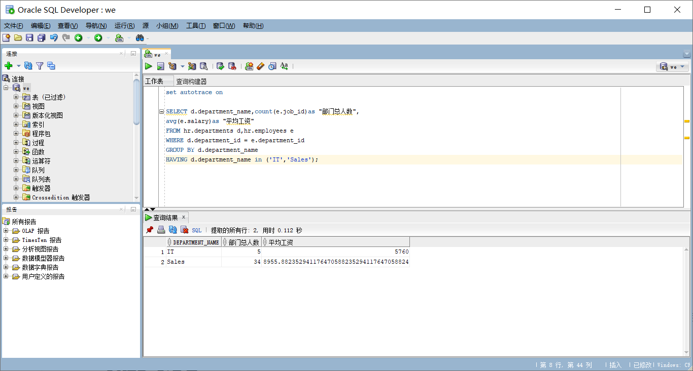
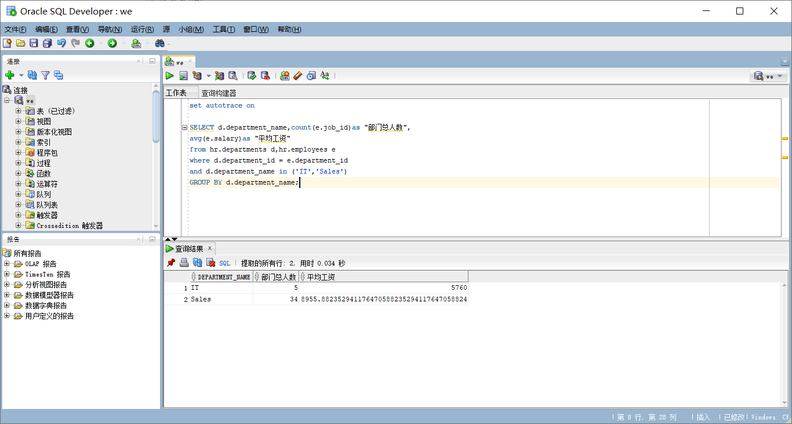
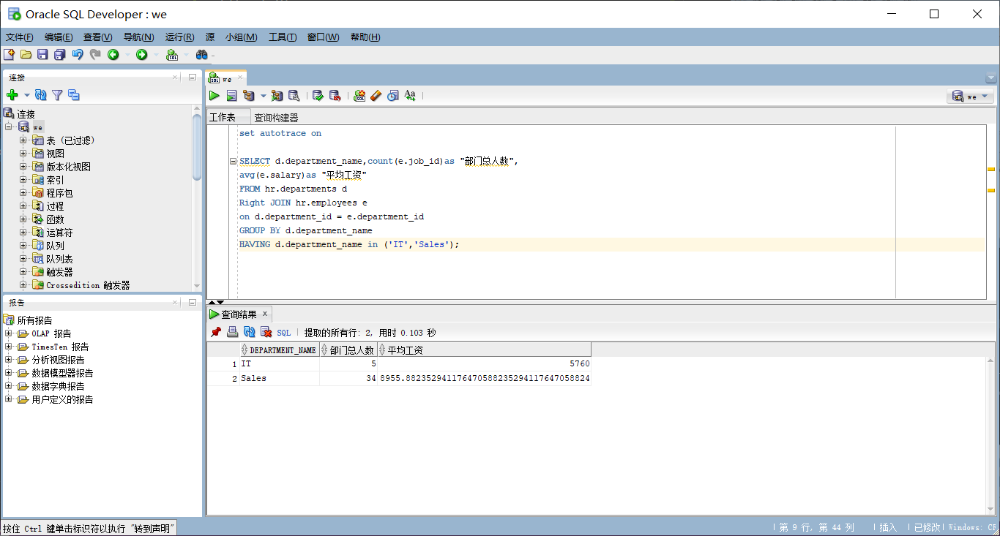

# oracle
# 班级:软工1班
# 学号：201810414110
# 姓名：苟丞相

## 实验目的：
####   分析SQL执行计划，执行SQL语句的优化指导。理解分析SQL语句的执行计划的重要作用。
## 实验内容：
#### 对Oracle12c中的HR人力资源管理系统中的表进行查询与分析。首先运行和分析教材中的样例：本训练任务目的是查询两个部门('IT'和'Sales')的部门总人数和平均工资，以下两个查询的结果是一样的。但效率不相同。设计自己的查询语句，并作相应的分析，查询语句不能太简单。
## 运行结果：
#### 查询语句：
``` set autotrace on

 set autotrace on
 SELECT d.department_name,count(e.job_id)as "部门总人数",
 avg(e.salary)as "平均工资"
 FROM hr.departments d,hr.employees e
 WHERE d.department_id = e.department_id
 GROUP BY d.department_name
 HAVING d.department_name in ('IT','Sales');
```

#### 查询语句：
``` set autotrace on

 SELECT d.department_name,count(e.job_id)as "部门总人数",
 avg(e.salary)as "平均工资"
from hr.departments d,hr.employees e
 where d.department_id = e.department_id
 and d.department_name in ('IT','Sales')
 GROUP BY d.department_name;
```

#### 自定义查询语句：
``` set autotrace on

SELECT d.department_name,count(e.job_id)as "部门总人数",
avg(e.salary)as "平均工资"
FROM hr.departments d
Right JOIN hr.employees e
on d.department_id = e.department_id
GROUP BY d.department_name
HAVING d.department_name in ('IT','Sales');
```

#### 分析：
#### 使用了右连接查询，相对于查询表一慢了一些，但是相对于查询表二快了一些，也有一些相对的缺陷，还可以使用很多的方法来写这个查询表，有左连接查询等，当然，效率和右查询表是差不多的。
#### 实验总结：
#### 这次实验主要是让我们学会用不同的方法进行表的查询，还有就是学会GitHub上提交自己的md文件。