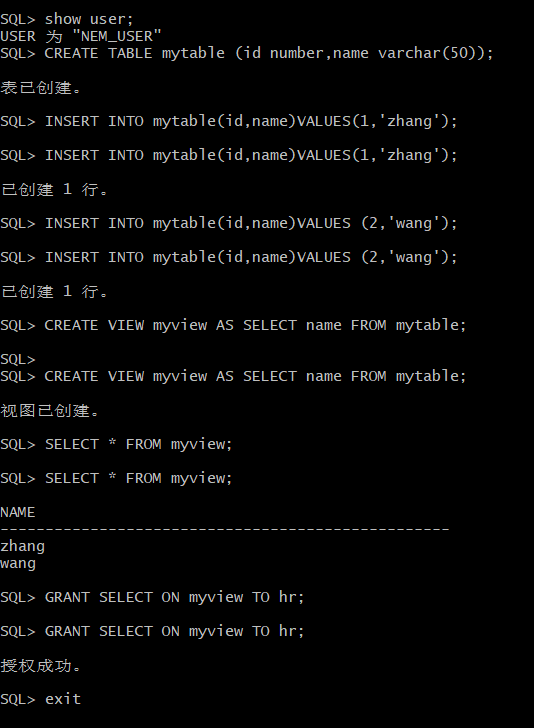
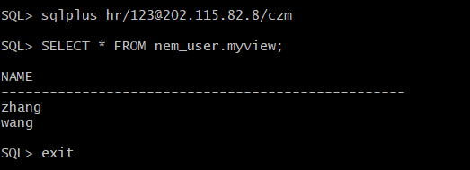
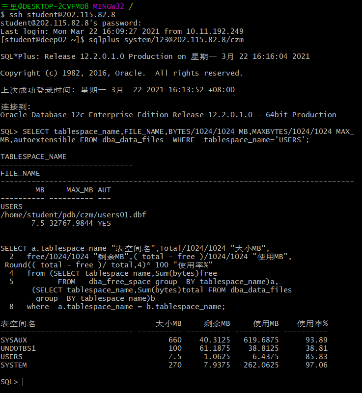

# oracle
# 班级:软工1班
# 学号：201810414110
# 姓名：苟丞相
## 实验目的：
#### 掌握用户管理、角色管理、权根维护与分配的能力，掌握用户之间共享对象的操作技能
## 实验内容：
#### .在pdborcl插接式数据中创建一个新的本地角色con_res_view，该角色包含connect和resource角色，同时也包含CREATE VIEW权限，这样任何拥有con_res_view的用户就同时拥有这三种权限。
#### .创建角色之后，再创建用户new_user，给用户分配表空间，设置限额为50M，授予con_res_view角色。
#### .最后测试：用新用户new_user连接数据库、创建表，插入数据，创建视图，查询表和视图的数据。
## 实验步骤：
### 第一步：以system登录到pdborcl，创建角色con_res_view和用户new_user，并授权和分配空间：
### 以system登录到pdborcl，创建角色com_res_view和用户nem_user，并授权和分配空间：
#### SQL> CREATE ROLE com_res_view;

#### 角色已创建。
####  GRANT connect,resource,CREATE VIEW TO com_res_view;
#### 授权成功。
#### CREATE USER nem_user IDENTIFIED BY 123 DEFAULT TABLESPACE users TEMPORARY TABLESPACE temp;
#### 用户已创建。
####  ALTER USER nem_user QUOTA 50M ON users;
#### 用户已更改。
####  GRANT com_res_view TO nem_user;
#### 授权成功。

### 第二步：新用户new_user连接到pdborcl，创建表mytable和视图myview，插入数据，最后将myview的SELECT对象权限授予hr用户。
####  show user;
#### USER 为 "NEM_USER"
#### CREATE TABLE mytable (id number,name varchar(50));
#### 表已创建。
#### INSERT INTO mytable(id,name)VALUES(1,'zhang');
#### 已创建 1 行。
#### INSERT INTO mytable(id,name)VALUES (2,'wang');
#### 已创建 1 行。
#### CREATE VIEW myview AS SELECT name FROM mytable;
#### 视图已创建。
#### SELECT * FROM myview;
#### NAME
#### --------------------------------------------------
#### zhang
#### wang
####  GRANT SELECT ON myview TO hr;
#### 授权成功。
####  exit

### 第三步：用户hr连接到pdborcl，查询new_user授予它的视图myview
#### SELECT * FROM nem_user.myview;
#### NAME
#### --------------------------------------------------
#### zhang
#### wang
#### exit

### 查看数据库的使用情况
#### SQL> SELECT tablespace_name,FILE_NAME,BYTES/1024/1024 MB,MAXBYTES/1024/#### 1024 MAX_                                                                                                                                  MB,autoextensible FROM dba_data_files  WHERE  tablespace_name='USERS';

#### TABLESPACE_NAME
#### ------------------------------
#### FILE_NAME
#### --------------------------------------------------------------------------------
####        MB     MAX_MB AUT
#### ---------- ---------- ---
#### USERS
#### /home/student/pdb/czm/users01.dbf
####       7.5 32767.9844 YES

#### SELECT a.tablespace_name "表空间名",Total/1024/1024 "大小MB",
####  2   free/1024/1024 "剩余MB",( total - free )/1024/1024 "使用MB",
#### Round(( total - free )/ total,4)* 100 "使用率%"
####  4   from (SELECT tablespace_name,Sum(bytes)free
####  5          FROM   dba_free_space group  BY tablespace_name)a,
####       (SELECT tablespace_name,Sum(bytes)total FROM dba_data_files
####        group  BY tablespace_name)b
####  8   where  a.tablespace_name = b.tablespace_name;

#### 表空间名                           大小MB     剩余MB     使用MB    使用率%
#### ------------------------------ ---------- ---------- ---------- ----------
#### SYSAUX                                660    40.3125   619.6875      93.89
#### UNDOTBS1                              100    61.1875    38.8125      38.81
#### USERS                                 7.5     1.0625     6.4375      85.83
##### SYSTEM                                270     7.9375   262.0625      97.06

## 实验总结：
#### 这次的实验主要是能够理解用户管理、角色管理、权限维护与分配的能力，掌握用户之间共享对象的操作技能，根据老师的操作步骤，学会了创建表，视图等，在本地创建了新的角色，及其用户，学会了用新用户连接数据库、创建表、插入数据，创建视图，查询表和视图的数据。
