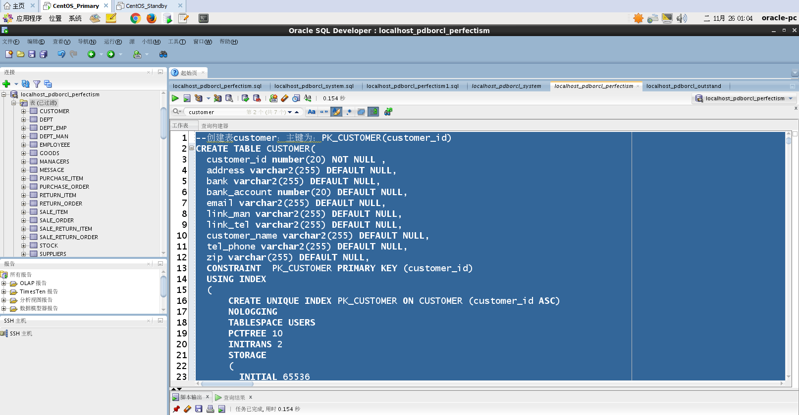
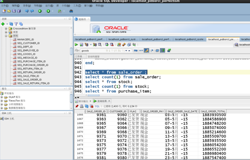

# 基于Oracle的进销存管理系统的数据库
# 班级:软工1班
# 学号：201810414110
# 姓名：苟丞相
## 实验目的
#### 了解PL/SQL语言结构
#### 了解PL/SQL变量和常量的声明和使用方法
#### 学习条件语句的使用方法
#### 学习分支语句的使用方法
#### 学习循环语句的使用方法
#### 学习常用的PL/SQL函数
#### 学习包，过程，函数的用法。
## 一、需求分析

#### 1.研究背景

目前，许多的中小企业普遍存在一个问题：企业的决策者看到的进销存资料及相关报表都是比较繁杂，让本应该一目了然的结果因信息的分散使得产生的结果无法保持一致和完整，造成企业在进销存管理上问题很多。由此发展而来的进销存管理系统就能够很好的解决上面出现的问题，能够将数据快速转化为有效信息,为企业管理者制定生存发展决策提供了依据。 

在现今社会中，各个产品的质量都相差不大，现在顾客对个性化服务的期望值越来越高，在产品质量一样的情况下顾客更看重的是哪家的服务更好。企业的竞争已渐渐从产品的竞争这个战场转变到服务的竞争这个战场，因此企业要发展的话就必须要进一步优化业务流程来提高企业自身的竞争能力。因此，加强进销存管理是企业能适应现阶段发展的必然，通过计算机来快速准确地完成大量本来由人工手工完成的工作，这是真正达到合理和充分利用现有资源，减轻了员工的工作压力，提高了企业的生产效率。

信息已深入到现代社会的各个行业，因此信息的管理需要有一个信息管理系统，进销存管理系统就是这样一个系统。进销存管理系统开发的市场将是非常庞大的。在这飞速发展的信息时代，这类的信息管理系统的开发为中小型企业带来了方便和有效的信息，促进了经济的发展。

## 二、数据库设计

#### 1.总的E-R图


#### 2.分E-R图

##### 2.1商品ER图


​                                                                                     

##### 2.2顾客ER图


##### 2.3供应商ER图


##### 2.4管理员ER图


#### 3.数据库表

##### 3.1系统数据库表

| 编号 | 表名              | 描述           |
| ---- | ----------------- | -------------- |
| 01   | customer          | 顾客表         |
| 02   | dept              | 部门表         |
| 03   | employee          | 员工表         |
| 04   | goods             | 商品表         |
| 05   | manager           | 管理员表       |
| 06   | purchase_item     | 采购单明细表   |
| 07   | purchase_order    | 采购订单表     |
| 08   | return_item       | 采购退货明细表 |
| 09   | return_order      | 采购退货表     |
| 10   | sale_item         | 销售订单明细表 |
| 11   | sale_order        | 销售订单表     |
| 12   | sale_return_item  | 退货销售明细表 |
| 13   | sale_return_order | 销售退货表     |
| 14   | stock             | 库存表         |
| 15   | suppliers         | 供应商表       |

##### 3.2顾客表

| 字段名        | 字段描述   | 类型/长度    | 约束     | 备注 |
| ------------- | ---------- | ------------ | -------- | ---- |
| customer_id   | 顾客编号   | NUMBER(20)   | PK       |      |
| customer_name | 顾客名称   | Varchar(20)  | NOT NULL |      |
| address       | 顾客地址   | Varchar(255) |          |      |
| zip           | 邮编       | Varchar(20)  |          |      |
| telPhone      | 联系电话   | Varchar(20)  |          |      |
| linkMan       | 联系人     | Varchar(20)  |          |      |
| linkTel       | 联系人号码 | Varchar(20)  |          |      |
| bank          | 开户银行   | Varchar(20)  |          |      |
| bankAccoount  | 银行账号   | NUMBER(20)   |          |      |
| email         | 邮箱       | Varchar(20)  |          |      |

##### 3.2部门表

| 字段名    | 字段描述 | 类型/长度   | 约束     | 备注 |
| --------- | -------- | ----------- | -------- | ---- |
| dept_id   | 部门编号 | NUMBER(20)  | PK       |      |
| dept_name | 顾客名称 | Varchar(20) | NOT NULL |      |

##### 3.3员工表

| 字段名               | 字段描述 | 类型/长度   | 约束     | 备注       |
| -------------------- | -------- | ----------- | -------- | ---------- |
| employee_id          | 员工编号 | NUMBER(20)  | PK       |            |
| employee_name        | 员工姓名 | Varchar(20) | NOT NULL |            |
| employee_password    | 密码     | Varchar(20) | NOT NULL | ＭＤ５加密 |
| employee_gender      | 性别     | Varchar(5)  |          |            |
| employee_age         | 年龄     | NUMBER(20)  |          |            |
| employee_phonenumber | 手机号码 | Varchar(20) |          |            |
| deptId               | 部门ID   | NUMBER(20)  | FK       |            |

##### 3.4商品表

| 字段名     | 字段描述   | 类型/长度    | 约束     | 备注 |
| ---------- | ---------- | ------------ | -------- | ---- |
| goods_id   | 商品编号   | NUMBER(20)   | PK       |      |
| goods_name | 商品名称   | Varchar(20)  | NOT NULL |      |
| unit       | 单位       | Varchar(20)  |          |      |
| space      | 商品产地   | Varchar(255) |          |      |
| supplierId | 供应商编号 | Varchar(20)  | FK       |      |
| approveId  | 批准文号   | Varchar(20)  |          |      |
| batchId    | 生产批号   | Varchar(20)  |          |      |

##### 3.5管理员表

| 字段名              | 字段描述   | 类型/长度    | 约束     | 备注       |
| ------------------- | ---------- | ------------ | -------- | ---------- |
| manager_id          | 管理员编号 | NUMBER(20)   | PK       |            |
| manager_name        | 管理员姓名 | Varchar(20)  | NOT NULL |            |
| manager_password    | 密码       | Varchar(20)  | NOT NULL | ＭＤ５加密 |
| manager_gender      | 性别       | Varchar(5)   |          |            |
| manager_age         | 年龄       | NUMBER(20)   |          |            |
| manager_phonenumber | 手机号码   | Varchar(20)  |          |            |
| dept_name           | 部门名称   | Varchar(255) | FK       |            |

##### 3.6采购单明细表

| 字段名                | 字段描述   | 类型/长度    | 约束 | 备注 |
| --------------------- | ---------- | ------------ | ---- | ---- |
| purchase_order_id     | 采购单编号 | NUMBER(20)   | PK   |      |
| suppliersId           | 采购商编号 | Varchar(20)  | FK   |      |
| purchase_order_pay    | 支付方式   | Varchar(20)  |      |      |
| inDate                | 采购日期   | Date         |      |      |
| purchase_order__total | 总金额     | NUMBER(20,2) |      |      |

##### 3.7采购退货明细表

| 字段名            | 字段描述           | 类型/长度    | 约束 | 备注 |
| ----------------- | ------------------ | ------------ | ---- | ---- |
| return_item_id    | 采购退货单明细编号 | NUMBER(20)   | PK   |      |
| returnOrderId     | 采购退货单编号     | NUMBER(20)   | FK   |      |
| goodsName         | 商品名称           | Varchar(20)  | FK   |      |
| return_item_price | 单价               | NUMBER(20,2) |      |      |
| return_item_count | 数量               | NUMBER(20)   |      |      |

##### 3.8销售订单明细表

| 字段名          | 字段描述         | 类型/长度    | 约束 | 备注 |
| --------------- | ---------------- | ------------ | ---- | ---- |
| sale_item_id    | 销售订单明细编号 | NUMBER(20)   | PK   |      |
| saleOrderId     | 销售订单编号     | NUMBER(20)   | FK   |      |
| sale_item_name  | 商品名称         | Varchar(20)  | FK   |      |
| sale_item_price | 单价             | NUMBER(20,2) |      |      |
| sale_item_count | 数量             | NUMBER(20)   |      |      |

##### 3.9销售订单表

| 字段名              | 字段描述   | 类型/长度    | 约束 | 备注 |
| ------------------- | ---------- | ------------ | ---- | ---- |
| sale_order_id       | 销售单编号 | NUMBER(20)   | PK   |      |
| customerId          | 顾客编号   | Varchar(20)  | FK   |      |
| sale_order_pay      | 支付方式   | Varchar(20)  |      |      |
| sale_order_saleDate | 销售日期   | Date         |      |      |
| sale_order_total    | 总金额     | NUMBER(20,2) |      |      |

##### 3.10销售退货明细表

| 字段名                 | 字段描述             | 类型/长度    | 约束 | 备注 |
| ---------------------- | -------------------- | ------------ | ---- | ---- |
| sale_return_item_id    | 销售退货订单明细编号 | NUMBER(20)   | PK   |      |
| saleReturnOrderId      | 销售退货订单编号     | NUMBER(20)   | FK   |      |
| goodsName              | 商品名称             | Varchar(20)  | FK   |      |
| sale_return_item_price | 单价                 | NUMBER(20,2) |      |      |
| sale_return_item_count | 数量                 | NUMBER(20)   |      |      |

##### 3.11销售退货表

| 字段名                       | 字段描述       | 类型/长度    | 约束 | 备注 |
| ---------------------------- | -------------- | ------------ | ---- | ---- |
| sale_return_order_id         | 销售退货单编号 | NUMBER(20)   | PK   |      |
| customerId                   | 顾客ＩＤ       | Varchar(20)  | FK   |      |
| sale_return_order_pay        | 支付方式       | Varchar(20)  |      |      |
| sale_return_order_returnDate | 退货日期       | Date         |      |      |
| sale_return_order_total      | 总金额         | NUMBER(20,2) |      |      |

##### 3.12库存表

| 字段名      | 字段描述     | 类型/长度    | 约束     | 备注 |
| ----------- | ------------ | ------------ | -------- | ---- |
| stock_id    | 库存编号     | NUMBER(20)   | PK       |      |
| goodsId     | 商品编号     | NUMBER(20)   | FK       |      |
| stock_count | 商品库存数量 | Varchar(20)  | NOT NULL |      |
| stock_area  | 存放地方     | Varchar(255) |          |      |

##### 3.13供应商表

| 字段名        | 字段描述   | 类型/长度    | 约束     | 备注 |
| ------------- | ---------- | ------------ | -------- | ---- |
| suppliers_id  | 供应商编号 | NUMBER(20)   | PK       |      |
| supplier_name | 供应商名称 | Varchar(20)  | NOT NULL |      |
| address       | 顾客地址   | Varchar(255) |          |      |
| zip           | 邮编       | Varchar(20)  |          |      |
| telPhone      | 联系电话   | Varchar(20)  |          |      |
| linkMan       | 联系人     | Varchar(20)  |          |      |
| linkTel       | 联系人号码 | Varchar(20)  |          |      |
| bank          | 开户银行   | Varchar(20)  |          |      |
| bankAccoount  | 银行账号   | NUMBER(20)   |          |      |
| email         | 邮箱       | Varchar(20)  |          |      |

## 三、建立表

#### 3.1首先，在localhost_pdborcl_perfectism用户下创建四个表空间

```
create tablespace users02 datafile '/home/oracle/app/oracle/oradata/orcl/users02_1.dbf' 
size 100m autoextend on next 50m maxsize unlimited,
'/home/oracle/app/oracle/oradata/orcl/users02_2.dbf' size 100m autoextend on next 50m
maxsize unlimited extent management local segment space management auto;

create tablespace users03 datafile '/home/oracle/app/oracle/oradata/orcl/users03_1.dbf' 
size 100m autoextend on next 50m maxsize unlimited,
'/home/oracle/app/oracle/oradata/orcl/users03_2.dbf' size 100m autoextend on next 50m
maxsize unlimited extent management local segment space management auto;


create tablespace users04 datafile '/home/oracle/app/oracle/oradata/orcl/users04_1.dbf' 
size 100m autoextend on next 50m maxsize unlimited,
'/home/oracle/app/oracle/oradata/orcl/users04_2.dbf' size 100m autoextend on next 50m
maxsize unlimited extent management local segment space management auto;

create tablespace users05 datafile '/home/oracle/app/oracle/oradata/orcl/users05_1.dbf' 
size 100m autoextend on next 50m maxsize unlimited,
'/home/oracle/app/oracle/oradata/orcl/users05_2.dbf' size 100m autoextend on next 50m
maxsize unlimited extent management local segment space management auto;
```


分析：上述sql语句下用户localhost_pdborcl_perfectism下创建了四个表空间，分别是USERS0,USERS02,USERS03,USERS04,USERS05。

#### 3.2在主库primary上在localhost_pdborcl_system下给创建用户perfectism 、outstand-创建了两个角色、两个用户，并将角色的权限授予用户

```
select * from  new_user;
select * from dba_roles ;
create role con_res_view_perfectism; 
create role sel_del_ins_perfectism;
grant connect,resource,create view to con_res_view_perfectism;
grant select ,delete,insert on userlog to con_res_view_perfectism;
create user perfectism identified by 123 default tablespace users temporary tablespace temp;
create user outstand identified by 123 default tablespace users temporary tablespace temp;
alter user perfectism quota 50m on users;
alter user outstand quota 50m on users;
grant con_res_view_perfectism to perfectism;
grant sel_del_ins_perfectism to perfectism;
grant con_res_view_perfectism to outstand;
grant sel_del_ins_perfectism to outstand;


alter user perfectism quota unlimited on users;
alter user perfectism quota unlimited on users02;
alter user perfectism quota unlimited on users03;

alter user perfectism quota unlimited on users;
alter user perfectism quota unlimited on users02;
alter user perfectism quota unlimited on users03;
```


分析：上面的语句就是新用户和所有的dba里面的角色，角色是权限的集合，接着创建了两个角色、两个用户，并将角色的权限授予用户,用户的默认表空间是users,用户perfectism和用户outstand

都有connect，resource角色的权限，创建视图的权限、对userlog表增、删、查的权限。

```
connect的默认权限:ALTER SESSION CREATE CLUSTER CREATE DATABASE LINK CREATE SEQUENCE CREATE SESSION CREATE SYNONYM CREATE TABLE CREATE VIEW       
resource 的默认权限:CREATE CLUSTER CREATE INDEXTYPE CREATE OPERATOR CREATE PROCEDURE CREATE SEQUENCE CREATE TABLE CREATE TRIGGER CREATE TYPE。

```

#### 3.3查询表空间

```
SELECT a.tablespace_name "表空间名",Total/1024/1024 "大小MB",
 free/1024/1024 "剩余MB",( total - free )/1024/1024 "使用MB",
 Round(( total - free )/ total,4)* 100 "使用率%"
 from (SELECT tablespace_name,Sum(bytes)free
        FROM   dba_free_space group  BY tablespace_name)a,
       (SELECT tablespace_name,Sum(bytes)total FROM dba_data_files
        group  BY tablespace_name)b
 where  a.tablespace_name = b.tablespace_name;

```


#### 3.4以用户perfectism 下做此次实验

```
在用户perfectism下创建18张表
SALE_RETURN_ITEM、SALE_RETURN_ORDER 、STOCK 、 SUPPLIERS 、 SALE_ITEM、  CUSTOMER、 DEPT、  DEPT_EMP、  DEPT_MAN 、 EMPLOYEEE、 GOODS、   MANAGERS 、MESSAGE 、  PURCHASE_ITEM 、RETURN_ITEM RETURN_ORDER、PURCHASE_ORDER、 SALE_ORDER 
```


查询用户perfectism下的所有表信息

Select * from user_tables;


分析：从上面的截图可以看出，这些表处于不同的表空间，USERS,USERS02,USERS03都有表存在。

 以其中插入了大量数据（共10万条数据，每张表2万条）的5张表来说明：

```
sale_order表、stock表、purchase_item表、customer表、goods表 
--创建表sale_order 创建主键为：PK_SALE_ORDER (sale_order_id)
create table sale_order (
  sale_order_id number(20) not null ,
  customer_id number(20) default null,
  flag varchar(255) default null,
  sale_order_pay varchar(255) default null,
  sale_order_sale_date date  default null,
  sale_order_total number(20,2) default null,
  constraint pk_sale_order primary key  (sale_order_id)
  )
  tablespace users
pctfree 10
initrans 1
storage
(
  buffer_pool default
)
nocompress
noparallel
partition by range (sale_order_sale_date)
(
  partition partition_before_2016 values less than (to_date(' 2016-01-01 00:00:00', 'syyyy-mm-dd hh24:mi:ss', 'nls_calendar=gregorian'))
  nologging
  tablespace users
  pctfree 10
  initrans 1
  storage
  (
    initial 8388608
    next 1048576
    minextents 1
    maxextents unlimited
    buffer_pool default
  )
  nocompress no inmemory
, partition partition_before_2017 values less than (to_date(' 2017-01-01 00:00:00', 'syyyy-mm-dd hh24:mi:ss', 'nls_calendar=gregorian'))
  nologging
  tablespace users02
  pctfree 10
  initrans 1
  storage
  (
    initial 8388608
    next 1048576
    minextents 1
    maxextents unlimited
    buffer_pool default
  )
  nocompress no inmemory
);
```


--创建表stock ，创建主键为：PK_STOCK (stock_id)

```
create table stock (
  stock_id number(20) not null  ,
  stock_area varchar(255) default null,
  stock_count number(20) default null,
  goods_id number(20) default null,
  constraint pk_stock primary key  (stock_id)
)
logging
tablespace users03
pctfree 10
initrans 1
storage
(
  initial 65536
  next 1048576
  minextents 1
  maxextents 2147483645
  buffer_pool default
);
```


--创建表purchase_item 创建主键为：pk_purchase_item (purchase_item_id)

```
create table purchase_item (
  purchase_item_id number(20) not null,
  purchase_count number(20) default null,
  p_name varchar(255) default null,
  purchase_price number(20，2) default null,
  purchase_order_id number(20) default null,
  supplier_id number(20) default null,
  constraint pk_purchase_item primary key  (purchase_item_id)
  )
  nologging
tablespace users
pctfree 10
initrans 1
storage
(
  initial 65536
  next 1048576
  minextents 1
  maxextents unlimited
  buffer_pool default
)
nocompress no inmemory noparallel;
```


--创建表customer：主键为：pk_customer(customer_id)

```
create table customer(
  customer_id number(20) not null ,
  address varchar2(255) default null,
  bank varchar2(255) default null,
  bank_account number(20) default null,
  email varchar2(255) default null,
  link_man varchar2(255) default null,
  link_tel varchar2(255) default null,
  customer_name varchar2(255) default null,
  tel_phone varchar2(255) default null,
  zip varchar(255) default null,
  constraint  pk_customer primary key (customer_id)
  using index
  (
      create unique index pk_customer on customer (customer_id asc)
      nologging
      tablespace users
      pctfree 10
      initrans 2
      storage
      (
        initial 65536
        next 1048576
        minextents 1
        maxextents unlimited
        buffer_pool default
      )
      noparallel
  )
  enable
)
nologging
tablespace users
pctfree 10
initrans 1
storage
(
  initial 65536
  next 1048576
  minextents 1
  maxextents unlimited
  buffer_pool default
)
nocompress no inmemory noparallel;
```



--创建表goods 创建主键为：pk_goods(goods_id),唯一约束：uk_goods(goods_name)

```
create table goods (
  goods_id number(20) not null,
  approve_id varchar(255) default null,
  batch_id varchar(255) default null,
  goods_name varchar(255) not null,
  price number(10,2) default null,
  space varchar(255) default null,
  supplier_id number(20) default null,
  unit varchar(255) default null,
  constraint pk_goods primary key  (goods_id)
  )nologging
tablespace users
pctfree 10
initrans 1
storage
(
  initial 65536
  next 1048576
  minextents 1
  maxextents unlimited
  buffer_pool default
)
nocompress no inmemory noparallel;
```


由于其中有id自增的表，所以就对那些表设置了序列，具体有这些表：CUSTOMER、 DEPT EMPLOYEE 、GOODS、 MANAGERS、 MESSAGE、 PURCHASE_ITEM、 PURCHASE_ORDER 、RETURN_ITEM、 RETURN_ORDER、 SALE_ITEM、 SALE_ORDER、 SALE_RETURN_ITEM、 SALE_RETURN_ORDER、 STOCK

 

 

--实现自增

--创建序列

```
create sequence  "seq_customer_id"  minvalue 1 maxvalue 9999999999 increment by 1 start with 1 cache 2000 order  nocycle  nopartition ;

create sequence  "seq_dept_id"  minvalue 1 maxvalue 9999999999 increment by 1 start with 1 cache 2000 order  nocycle  nopartition ;
create sequence  "seq_employee_id"  minvalue 1 maxvalue 9999999999 increment by 1 start with 1 cache 2000 order  nocycle  nopartition ;

create sequence  "seq_goods_id"  minvalue 1 maxvalue 9999999999 increment by 1 start with 1 cache 2000 order  nocycle  nopartition ;
create sequence  "managers_id"  minvalue 1 maxvalue 9999999999 increment by 1 start with 1 cache 2000 order  nocycle  nopartition ;

create sequence  "seq_message_id"  minvalue 1 maxvalue 9999999999 increment by 1 start with 1 cache 2000 order  nocycle  nopartition ;
create sequence  "seq_purchase_item_id"  minvalue 1 maxvalue 9999999999 increment by 1 start with 1 cache 2000 order  nocycle  nopartition ;

create sequence  "seq_purchase_order_id"  minvalue 1 maxvalue 9999999999 increment by 1 start with 1 cache 2000 order  nocycle  nopartition ;
create sequence  "seq_return_item_id"  minvalue 1 maxvalue 9999999999 increment by 1 start with 1 cache 2000 order  nocycle  nopartition ;

create sequence  "seq_return_order_id"  minvalue 1 maxvalue 9999999999 increment by 1 start with 1 cache 2000 order  nocycle  nopartition ;
create sequence  "seq_sale_item_id"  minvalue 1 maxvalue 9999999999 increment by 1 start with 1 cache 2000 order  nocycle  nopartition ;

create sequence  "seq_sale_order_id"  minvalue 1 maxvalue 9999999999 increment by 1 start with 1 cache 2000 order  nocycle  nopartition ;
create sequence  "seq_sale_return_item_id"  minvalue 1 maxvalue 9999999999 increment by 1 start with 1 cache 2000 order  nocycle  nopartition ;

create sequence  "seq_sale_return_order_id"  minvalue 1 maxvalue 9999999999 increment by 1 start with 1 cache 2000 order  nocycle  nopartition ;
create sequence  "seq_stock_id"  minvalue 1 maxvalue 9999999999 increment by 1 start with 1 cache 2000 order  nocycle  nopartition ;

```

分析：

该语句创建了15个具有自增的序列：SEQ_CUSTOMER_ID,SEQ_DEPT_ID,SEQ_EMPLOYEE_ID, SEQ_GOODS_ID,MANAGERS_ID,SEQ_MESSAGE_ID,SEQ_PURCHASE_ITEM_ID ,SEQ_PURCHASE_ORDER_ID,SEQ_RETURN_ITEM_ID,SEQ_RETURN_ORDER_ID,SEQ_SALE_ITEM_ID ,SEQ_SALE_ORDER_ID, SEQ_SALE_RETURN_ITEM_ID ,SEQ_SALE_RETURN_ORDER_ID ,SEQ_STOCK_ID，这些都是为15个表创建的，用以模拟自增，最小从1开始，最大为9999999999，步长为1，不循环，cache用于可见，防止拿到同一个序列数，一般cache元素的个数 <= 循环元素个数。


#### 4.4插入数据

--批量插入

```
declare
  dt date;
 v_customer_id  number(20);
  v_id number(20);
  v_sale_order_pay varchar(255);
  v_sale_order_total number(20,2);
  v_flag varchar(255);
  m number(20);
 area varchar(255);
  goods_id number(20);
  temp number(20);
p_name varchar(255);
p_price number(20,2);
supplier_id number(20);
purchase_order_id  number(20);
p_count number(20);
v_tel number(20);
email varchar(255);
tel_phone varchar(255);
zip varchar(255);
p_space varchar(255);
app_id varchar(255);
p_add  varchar(255);
batch_id  varchar(255);
space varchar(255);
p_bank varchar(255);
v_name varchar(255);
begin
  for i in 1..20000
  loop
    if i mod 2 =0 then
      dt:=to_date('2015-05-03','yyyy-mm-dd')+(i mod 60);
    else
      dt:=to_date('2016-05-03','yyyy-mm-dd')+(i mod 60);
    end if;
    v_customer_id:=i;
```

--插入订单

```
v_id:=seq_sale_order_id.nextval; --应该将seq_sale_order_id.nextval保存到变量中。
if i mod 2 =0 then
       v_sale_order_pay:='现金';
    else
       v_sale_order_pay:='银行卡';
    end if;
    v_name := 'wang' || i;
  if i mod 2 =0 then
      v_flag:='已发货';
    else
       v_flag:='未发货';
    end if;
 v_sale_order_total:=dbms_random.value(10000,5000);
    insert/*+append*/into sale_order(sale_order_id,customer_id,flag,sale_order_pay,sale_order_sale_date,sale_order_total) values ( v_id,v_customer_id  ,v_flag,v_sale_order_pay,dt,v_sale_order_total);
    m:=dbms_random.value(100,10);
if i mod 2 =0 then
       area:='a1';
    else
       area:='c2';
    end if;
  goods_id :=i;
 v_id:=seq_stock_id.nextval;
    insert /*+append*/ into stock(stock_id,stock_area,stock_count,goods_id) values (v_id,area,m,goods_id );
   p_count :=dbms_random.value(100,10);
   case 
	when  i mod 5 =1 then 
       p_name :='魅族';
       p_price:=3000.00;
      supplier_id:=1001;
	when  i mod 5=2 then
    p_name :='华为';
     supplier_id:=1002;
    p_price:=5400.00;
    when  i mod 5=3 then
   p_name :='三星';
       p_price:=3800.00;
  supplier_id:=1003;
	when  i mod 5=4 then
  p_name :='荣耀';
  supplier_id:=1004;
   p_price:=2100.00 ;
   else 
       p_name :='oppo';
     supplier_id:=1005;
     p_price:=4100.00;
end case;

purchase_order_id:=i;
v_id:=seq_purchase_item_id.nextval;
    insert/*+append*/into purchase_item(purchase_item_id,purchase_count,p_name,purchase_price,purchase_order_id,supplier_id) values (v_id, p_count,p_name,p_price,purchase_order_id,supplier_id);
    p_count :=dbms_random.value(9000,2000);
v_id:=seq_customer_id.nextval;
v_tel:='139888883'||i;
tel_phone:='0790-7378785789'||i;
zip:='3274837'||i;

  case 
	when  i mod 5 =1 then 
       p_add:='四川省';
       p_bank:='建设银行';
       supplier_id:=100100000;
       email:='welcase@123.com';
	when  i mod 5=2 then
       p_add:='成都市';
       supplier_id:=100200000;
       p_bank:='中国银行';
       email:='deffcase@123.com';
    when  i mod 5=3 then
        p_add :='浙江省';
        p_bank:='工商银行';
       email:='johnsdifen@123.com';
        supplier_id:=100300000;
	when  i mod 5=4 then
      p_add :='湖南省';
      supplier_id:=100400000;
       p_bank:='邮政银行' ;
     email:='perfectism@123.com';
   else 
      p_add :='山东省';
     supplier_id:=100500000;
      p_bank:='交通银行';
     email:='sedeed@123.com';
end case;
  
   
 insert/*+append*/into customer(customer_id,address,bank,bank_account,email,link_man,link_tel,customer_name,tel_phone,zip) values (v_id,p_add,p_bank,supplier_id,email, v_name,v_tel,'xxx电子商务有限公司',tel_phone,zip);
  v_id:=seq_goods_id.nextval;
  case 
	when  i mod 5 =1 then 
       p_name :='魅族';
       p_price:=3000.00;
       supplier_id:=1001;
	when  i mod 5=2 then
       p_name :='华为';
       supplier_id:=1002;
        p_price:=5400.00;
    when  i mod 5=3 then
         p_name :='三星';
       p_price:=3800.00;
       supplier_id:=1003;
	when  i mod 5=4 then
        p_name :='荣耀';
        supplier_id:=1004;
        p_price:=2100.00 ;
   else 
      p_name :='oppo';
      supplier_id:=1005;
    p_price:=4100.00;
end case;

app_id:='13243434564'||i;
batch_id:='65454213'||i;
p_space:=dbms_random.value(9000,2000);
insert  into goods(goods_id,approve_id,batch_id,goods_name,price,space,supplier_id,unit) values (v_id,app_id,'batch_id',p_name,p_space,p_add,supplier_id,'台');
    --在触发器关闭的情况下，需要手工计算每个订单的应收金额：

    select sum(purchase_count*purchase_price) into m from purchase_item,sale_order where sale_order.sale_order_id=purchase_item.purchase_order_id;
    if m is null then
     m:=0;
    end if;
     temp:=i;
    update  sale_order set sale_order_total = m where sale_order_id=temp;
    if i mod 1000 =0 then
      commit; --每次提交会加快插入数据的速度
    end if;
  end loop;
end;
```

分析：

该sql语句在脚本里面先是声明了在插入表的用于存放数据的变量，有5张表的变量，其中包括时间类型，字符类型，数值类型，浮点类型，当然oracle与其它的数据库（MYSQL）不一样，它使用number(位数,保留位数)来设置的浮点数类型，在开始运行脚本之前，都会在变量声明之后跟上一个begin ,接着写循环的sql脚本，循环的次数是20000，就是说对sale_order表,stock表, purchase_item表,customer表,goods表这5张表分别插入了20000条数据。截图如下：


下面对其进行验证：分别查询每张表的数据。

```
查询sale_order表：
select * from sale_order ;
select count(1) from sale_order;
```




查询purchase_item表

```
select * from purchase_item;
select count(1) from purchase_item;

```


查询customer表：


--创建包体

```
CREATE OR REPLACE
PACKAGE BODY MYPACKAGE AS
  function getTotalSal(pid in number) 
    return number 
as 
    price purchase_item.purchase_price%type ;
    
    pcount purchase_item.purchase_count%type ;
begin 
    select purchase_price ,purchase_count into price,pcount from purchase_item where purchase_item_id = pid ;
    dbms_output.put_line( price*nvl( pcount,0));
    return price*nvl( pcount,0) ;
end ;

  procedure queryEmpList(dno in number , costomerList out coscursor)  AS
  BEGIN
        open costomerList for 
        select * from customer where customer_id = dno;
        
  END queryEmpList;

END MYPACKAGE;

```


# 总结

​      现在市面上流行的也就那几大数据库（mysql,oracle,sql server），但是说不好,以后可能又会有新的好用的数据库，比如现在又有阿里巴巴的ocean数据库，远超oracle，就我而言，我可能接触的最多的是MySQL，因为但是刚刚接触编程语言设计数据库的时候就用的MySQL，当然，它适用于小中型企业，数据量不是特别大，操作起来也比较方便一点，最重要的一点是开源。

 人总是要跟上时代的步伐才行，多掌握一种数据库也是好的，而且oracle在很多大公司使用的相当频繁，一直处于数据库层面的中流砥柱，所以学好Oracle相当有必要，我是先跟着老师入门，对其有一定的了解，比如oracle的结构的结构，文件类型等等，有一个大概的了解，之后才学习它具体的对数据的操作方法，当然学习了这么久的Oracle，就让我来谈谈它与MySQL的一些区别吧。 安装就不说了，MySQL是要简单一点，配置也很简单，这个安装配置的复杂性主要体现在服务器上。当然我也有安装他们两个数据库的经历，就mysql而言是要简单一点，oralce就对服务器硬盘等等的要求也极高，硬盘至少要高于30个G（我的是80G的虚拟机）,这个经历是惨痛的，但是就是因为日志备份文件找不到适合空间存放而重装。我对Oracle对象管理及使用思想有了进一步的了解，通过动手实现Oracle对象管理及使用，更加深刻的理解了Oracle对象管理及使用的特点。在实验中实现了表结构的建立、修改、查看、删除操作。实现了索引的建立、修改、查看、删除操作。实现了视图的建立、查询、修改、删除操作。实现了 同义词的建立、查询、修改、删除操作，比较对同义词的操作与对原数据库对象的操作是否一致。了解并实现了用alter table old_table_name rename to new_table_name表名进行修改。通过create index index_name on table_name(column_name1asc|desc,column_name2 asc|desc....)创建基于多列的索引。掌握序列的建立、查询、修改、删除操作，利用序列向数据库表中插入数据。并且在实验过程中，回顾书本上的理论知识，巩固了我的知识。